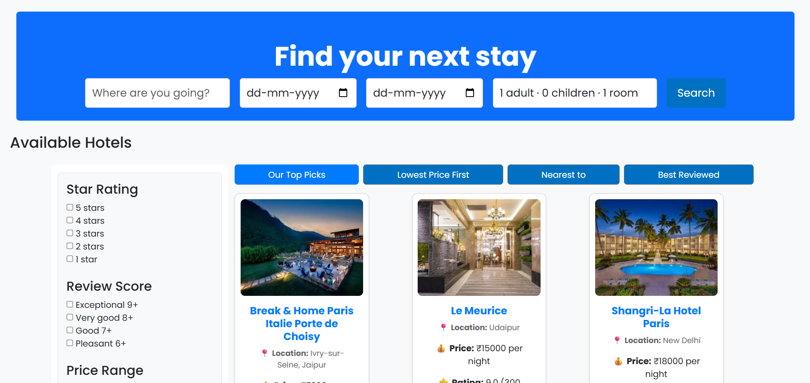
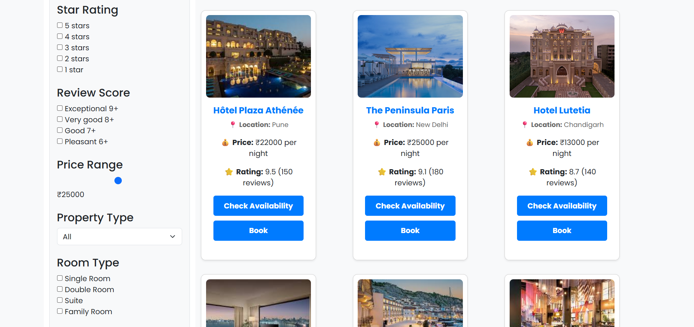

# 🏨 Flask Hotel Booking System

A web-based **Hotel Booking System** built using **Flask, HTML, and CSS** that allows users to browse hotels and manage bookings through a simple interface.

---

## 🚀 Features

- User-friendly hotel booking interface
- Flask backend for server-side logic
- Responsive frontend using HTML & CSS
- Database integration using SQLite
- Organized project structure following Flask best practices

---

## 🛠️ Tech Stack

Backend:
- Python
- Flask

Frontend:
- HTML5
- CSS3

Database:
- SQLite

---

## 📸 Application Screenshots

### 🏠 Home Page
<p align="center">

</p>

### 📅 Booking Page
<p align="center">


</p>

### 🔥 Deals of the Day Page
<p align="center">

</p>

## 📁 Project Structure

```
FinalHotelBooking
│
├── finalHotelBooking
│   ├── instance
│   ├── static
│   │   ├── css
│   │   └── images
│   ├── templates
│   │   ├── index.html
│   │   ├── booking.html
│   │   └── layout.html
│   ├── app.py
│   └── requirements.txt
│
├── Screenshots/
│   ├── BookingPage.png
│   ├── BookingPage2.png
│   ├── DealsOfTheDay.png
│   └── HomePage.png
│
├── .gitignore
├── LICENSE
└── README.md
```

---

## ⚙️ Installation

Clone the repository

```bash
git clone https://github.com/YOUR_USERNAME/flask-hotel-booking.git
```

Navigate into the project

```bash
cd flask-hotel-booking
```

Create virtual environment

```bash
python -m venv env
```

Activate environment

Windows

```bash
env\Scripts\activate
```

Install dependencies

```bash
pip install -r requirements.txt
```

Run the application

```bash
python app.py
```

---

## 🌐 Usage

Open your browser and visit

```
http://127.0.0.1:5000
```

---

## 📌 Future Improvements

- User authentication
- Payment integration
- Hotel search filters
- Admin dashboard

---

## 👩‍💻 Author

Aashna

---

## 📜 License

This project is licensed under the MIT License.